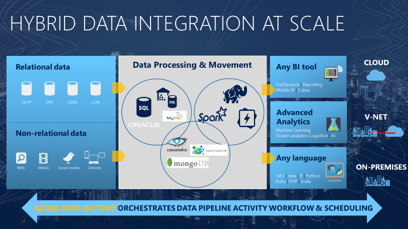
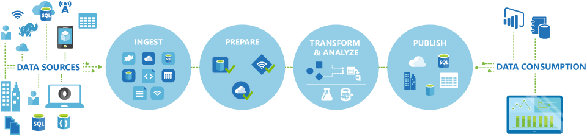
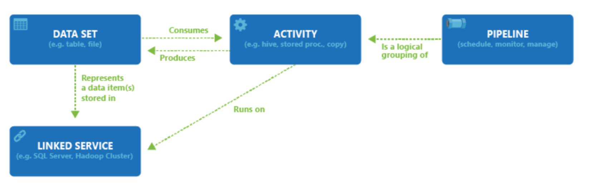

## Introduction

With the wide range of data stores available in Azure, there's the need to manage and orchestrate the movement data between them. You could automate a regular process of data movement as part of a wider enterprise analytics solution. 

## Understand Azure Data Factory

Azure Data Factory is the service that can be used to trigger the batch movement of data, or to set up a regular schedule for most analytics solutions. ADF provides a cloud-bsed data integration service that orchestrates the movement and transformation of data between various data stores and compute resources.

### What is meant by orchestration?

Symphoney orchestra => central memeber of orchestra = condunctor who deos not play the instructments, they simply lead the symphony members through the entire piece of music that they perform. ADF uses similar approach. 

ADF has native functionality to ingest and transform data, sometimes it will instruct another service to perform the actual work required on its behalf. It also provides rich visualization to display the lineage and dependencies between your data pipelines and monitor all your data pipelines from a single unified view to easily pinpoint issues and setup monitoring alerts. 

## Data Integration Patterns

Data integration firstly involves the collection of data from one or more sources. Optionally, it typically then includes a process where the data may be cleansed and transformed, or perhaps augmented with additional data and prepared. Finally, the amalgamated data is stored in a data platform service that handles the type of analytics that you want to perform. This process can be automated by Azure Data Factory in a pattern known as Extract, Transform and Load (ETL).

### Extract

Data Engineers define the data and its sources:
- identify source details souce as the resource group, subscription, and identity information such as a key or secret.
- identify the data to be extracted. Define data by using a database query, a set of files, or an Azure Blob storage name for blob storage. 

### Transform

- splitting, combining, deriving, adding, removing, or pivoting columns.
- map fields between the data source and the data desitination.

### Load

- you might need to write code to interact with application APIs, so Azure destinations can accept data in a various format (JSON, Excel, blob, etc)
- test the ETL job in a development or test environment, then migrate the job to a production environment to load the production system
- setup a proactive and reactive monitoring system to provide information when things go wrong (logging according to the technology)

### ETL tools

ADF provides nearly 100 enterprise connectors and robust resources for both code-free and code-bsed users to accomplish their data movement and transformation needs. 

### Evolution from ETL

Azure can handle unstructured data at an unlimited scale. This change has shifted the paradigm from ETL to ELT (extract, load and then transform).

Benefit of ELT:
- store data in its original format (JSON, XML, PDF, Images)
- define the data structure during the transformation phase, can use the source data in multiple downstream systems
- data is extracted and loaded in its native format, which reduces the time required to load the data into a destination system, limits resource contention on the data sources

There might be another process like ELT called ELTL, which is that it has a final load into a destination system. These two patterns both supported by ADF.

### Modern Data Warehouse Workloads

Usually, it's a centralized data store that provides descriptive analytics and decision support services across the whole enterprise using strcutured, unstructured, or streaming data soruces. Data flows into the warehouse from multiple transcational systems, relational databases, and other data sources on a periodic basis. The stored data is used for historical and trend analysis reporting. The data warehouse acts as a central repository for many subject areas and contains the "single source of truth".

ADF is typically used to automate the process of ETL(ELT) through a batch process against structured and unstructured data sources. 

### Advance Analytical Workloads

ADF provides the integration from source systems into a Data Lake store, and can initiate compute resources such as Azure Databricks, or HDInsight to use the data to perform the advanced analytical work. 

## Explain the Data Factory Process

### Data-Driven Workflows 

The pipelines (Data-Driven Workflows) in ADF typically perform the following four steps:

- Connect and Collect: define and connect all the required sources of data together, such as database, file shares, and FTP web services, ingest the data as needed to a centralized location for subsequent processing.
- Transform and Enrich: prepare or produce transformed data on a maintainable and controlled schedule to feed production environments with cleansed and transformed data.
- Publish: load the data into Azure or whichever analytics engine your business users can point to from their BI tools
- Monitor: ADF has built-in pipeline monitoring support via Azure Monitor, API, PowerShell, Azure Monitor logs, and health panels on Azure portal

## Understand ADF components

An Azure subscription might have one or more ADF instances. ADF is composed of four core components. 
- Linked Service, whch enables you to ingest the data from a data source in readiness to prepare the data fro transformation and/or analysis
- Dataset, represents data structures within the data store that is being referenced by the Linked Service object. (can be used by an ADF object known as Activity)
- Activities, contains the transformation logic or the analysis commands of ADF's work
- Multiple activities can be logically grouped together within an object refered as Pipeline, and these can be scheduled to execute, triggered, etc.

## ADF Security

To create ADF instance, the user account must be a member of the contributor or owner role, or an administrator of Azure subscription.

To create ADF objects, such as datasets, linked services, pipelines, triggers, and integration runtimes, you must belong to the data factory contributor role at the resource group level or above to create/manage child resources in the Azure portal. The basic contributor role at the source level or above is sufficient to create and manage resources with PowerShell or the SDK.

## Manage Integration Runtimes

An Activity defines the action to be performed. 

A Linked Service defines a target data store or a compute service. 

An integration runtime provides the infrastructure for the activity and linked services. It's referenced by the linked service or activity, and provides the compute environment where the activity either runs on or get dispatched from. This way, the activity can be performed in the region closest possible to the target data store or compute service in the most performant way while meeting security and compliance needs.

In short, the integration runtime is the comput infrastructure used by ADF. 

### Integration Runtime Types
- Azure
- Self-hosted
- Azure-SSIS