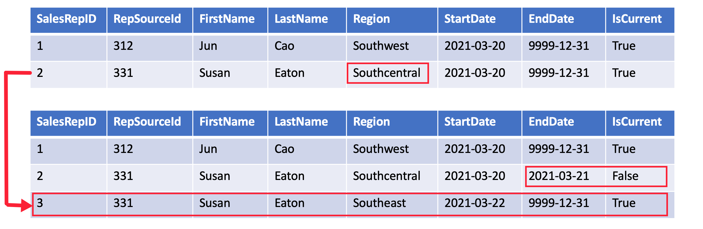
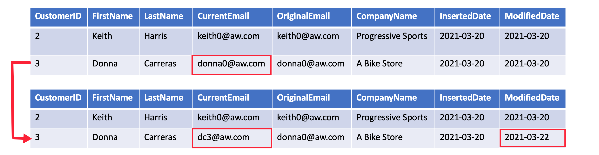
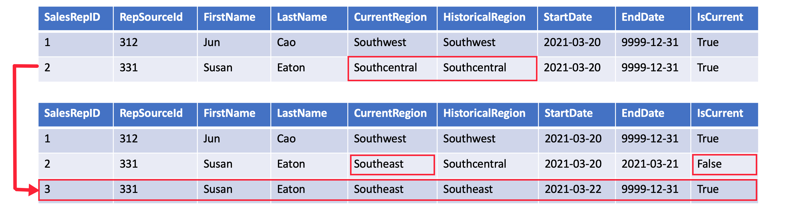

## Introduction

Slowly changing dimensions (SCD) are tables in a dimensional model that handle changes to dimension values over time. Learning the best practices to design and load slowly changing dimensions will help you successfully handle changes in your data. 

## Define and describe SCD

A slowly changing dimension (SCD) is one that appropriately manages the change of dimension members over time. It applies when the values of a business entity change over time, and not on a set schedule. For example, a customer dimension, specifically its contact detail columns like email address and phone number. In contrast, some dimensions are considered to be rapidly changing when a dimension attribute changes often, like a stock's market price. The common design approach in these instances is to store rapidly changing attribute values in a fact table measure. However, for SCDs the changing members should remain in the dimension table. The design used for handling changes depends on the business requirements for the dimension table. 

### SCD Example

Assume you are designing a customer dimension table as part of a star schema model for tracking sales transactions. This table would include attributes like company name and email address. If the company name or phone number changes, do you want to treat that as a new customer? Probably not. Instead, you need a way to update the existing record or to keep track of all historical changes to the values. 

When handling data changes, the table design varies depending on if you choose to update values without history or to track each version of history. 

In other words, will you allow updates to records? When the answer is yes, you should add additional date fields to your table to track when the data was updated in your analytics database. For instance, you'd better have two extra columns to track when the record was added and modified. 

#### star schema model

Start schema is a mature modeling approach widely adopted by relational data warehouses. It requires modelers to classify their model tables as either dimension or fact. 

- dimension tables describe business entities - the things you model. The most consistent table you'll find in a star schema is a date dimension table. A dimension table contains a key column (or columns) that acts as a unique identifier, and descriptive columns.
- fact tables store observations or events, and can be sales order, stock balances, exchange rates, temperatures, etc. A fact table contains dimension key columns that relate to dimension tables, and numeric measure columns. The dimension key columns determine the dimensionality of a fact table, while the dimension key values determine the granularity of a fact table. For example, consider a fact table desinged to store sale targets that has two dimension key columns Date and ProductKey. It's easy to understand that the table has two dimensions. The granularity, however, can't be determined without considering the dimension key values. In this example, consider that the values stored in the Date column are the first day of each month. In this case, the granularity is at month-product level. 

Generally, dimension tables contain a relatively small numer of rows. Fact tables, on the other hand, can contain a very large number of rows and continue to grow over time. 

### SCD types

Star schema design theory refers to common SCD types. The most common are Type 1 and Type 2. In practice, a dimension table may support a combination of history tracking methods, including Type 3 and Type 6. 

#### Type 1 SCD

Type 1 SCD always reflects the latest values, and when changes in source data are detected, the dimension table data is overwritten. Commonly for columns that store supplementary values, like the email address or phone number of a customer. When these values changes, the dimension table updates the customer row with the new values. It's as if the customer always had this contact information. The key field, such as CustomerID, would stay the same so the records in the fact table automatically link to the updated customer record.

#### Type 2 SCD

Type 2 SCD supports versioning of dimension members. Often the source sytem doesn't store versions, so the data warehouse load process detects and manages changes in a dimension table. In this case, the dimension table must use a surrogate key to provide a unique reference to version of the dimension member. It also includes columns that define the date range validity of the version (for example, startdate and enddate) and possibly a flag column (for example, iscurrent) to easily filter by current dimension members.

#### Type 3 SCD

Type 3 SCD supports storing two versions of a dimens member as separate columns. The table includes a column for the current value of a member plus either the original or previous value of the member. So Type 3 uses additional columns to track one key instance of history, rather than storing additional rows to track each change like a Type 2 SCD. 

#### Type 6 SCD

Type 6 SCD combines Type 1, 2, and 3. When a change happens to a Type 2 member you can create a new row with appropriate StartDate and EndDate. In Type 6 design you also store the current value in all versions of that entity so you can easily report on the current value or the historical value. 

