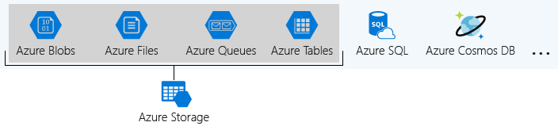

## What is Azure Storage?

Azure provides many ways to store your data, including multiple database options like Azure SQL Database, Azure Cosmos DB, and Azure Table Storage. Azure offers multiple ways to store and send messages, such as Azure Queues and Event Hubs. You can even store loose files using services like Azure Files and Azure Blobs.

Azure groups four of these data services together under the name Azure Storage. The four services are Azure Blobs, Azure Files, Azure Queues, and Azure Tables. The following illustration shows the elements of Azure Storage.

These four data services are all primitive, cloud-based storage services, and are often used together in the same application.

## What is a storage account?

A storage account is a container that groups a set of Azure Storage services together. Only data services from Azure Storage can be included in a storage account (Azure Blobs, Azure Files, Azure Queues, and Azure Tables). The following illustration shows a storage account containing several data services.

Combining data services into a single storage account enables you to manage them as a group. The settings you specify when you create the account, or any changes that you make after creation, apply to all services in the storage account. Deleting a storage account deletes all of the data stored inside it.

A storage account is an Azure resource and is part of a resource group. The following illustration shows an Azure subscription containing multiple resource groups, where each group contains one or more storage accounts.

Other Azure data services, such as Azure SQL and Azure Cosmos DB, are managed as independent Azure resources and can't be included in a storage account. The following illustration shows a typical arrangement: Blobs, Files, Queues, and Tables are contained within storage accounts, while other services aren't.

## Choose your account settings

### Name

Each storage account has a name. The name must be globally unique within Azure, use only lowercase letters and digits and be between 3 and 24 characters.

### Deployment model

A deployment model is the system Azure uses to organize your resources. The model defines the API that you use to create, configure, and manage those resources. Azure provides two deployment models, Resource Manager and Classic.

Most Azure resources only work with Resource Manager, which makes it easy to decide which model to choose. 

However, storage accounts, virtual machines, and virtual networks support both, so you must choose one or the other when you create your storage account.

The key feature difference between the two models is their support for grouping. The Resource Manager model adds the concept of a resource group, which isn't available in the classic model. A resource group lets you deploy and manage a collection of resources as a single unit.

Microsoft recommends that you use the Resource Manager deployment model for all new resources.

### Account kind

Storage account kind is a set of policies that determine which data services you can include in the account and the pricing of those services. There are four kinds of storage accounts:

- Standard - StorageV2 (general purpose v2): the current offering that supports all storage types and all of the latest features
- Premium - Page blobs: Premium storage account type for page blobs only
- Premium - Block blobs: Premium storage account type for block blobs and append blobs
- Premium - File shares: Premium storage account type for file shares only

Microsoft recommends that you use the Standard - StorageV2 (general purpose v2) option for new storage accounts.

The core advice is to choose the Resource Manager deployment model and the Standard - StorageV2 (general purpose v2) account kind for all your storage accounts. For new resources, there are few reasons to consider the other choices.